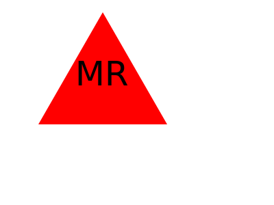

# Logo Generator

## Descriptoin

Summary: Object oriented logo generator using JavaScript with testing from Jest. 

A command line JavaScript program that tests classes using Jest as well as takes user input to create a SVG file (which is the logo). It uses the Jest JavaScript testing framework to test the classes of the program. It uses node js and the inquirer for prompts. Each test is located in the test directory. To run the tests simply run the command "npm run test." Each test should pass unless the corresponding JavaScript class file changes in a way. These class files are located in the lib directory. To run the program run the command "node index.js." It will start by asking for information from the user. Depending on input a shape will be made. Each shape is a class (circle, square, triangle). Each of those shapes inherit the parent class "shape.js." Once the application is done running a file is made in the examples directory called "logo.svg."   

## Logos Generated

 ## Installation

Make sure to have node js installed. I used the recommended version which is 20.10.0 LTS as of now. After installed, in the terminal type "npm install -y" and hit enter. This should install the inquirer, jest, and the max length for inquirer packages. Afterwards type "node index.js" to run the code.

Link to node js: https://nodejs.org/en/

## Usage

Follow how I did it in the video, to see the user input and commands used in terminal. Once input has been entered and the code has completed, a 'logo.js' file should appear in the directory "examples." NOTICE: This will overwrite the current file in that directory.

https://www.youtube.com/watch?v=npjWShLRIV8

## License

